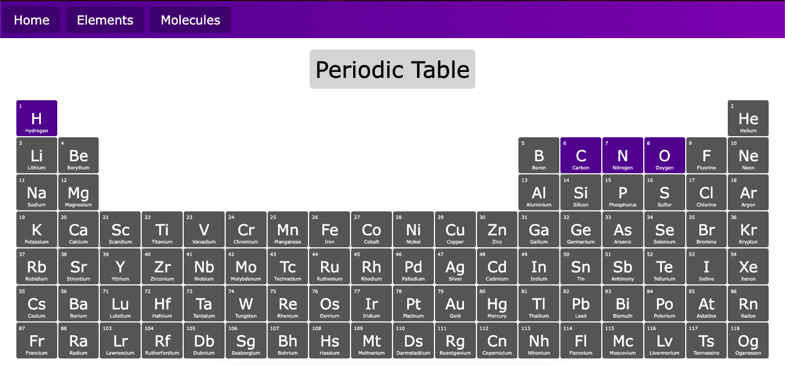
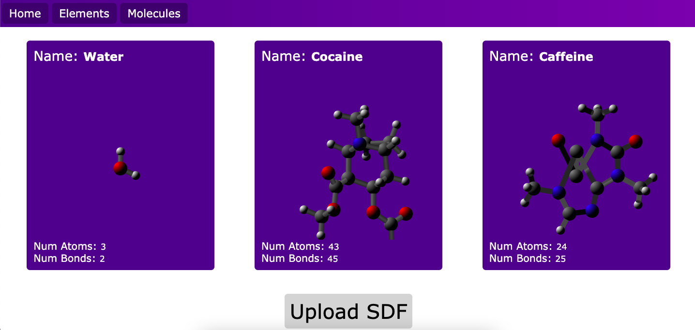
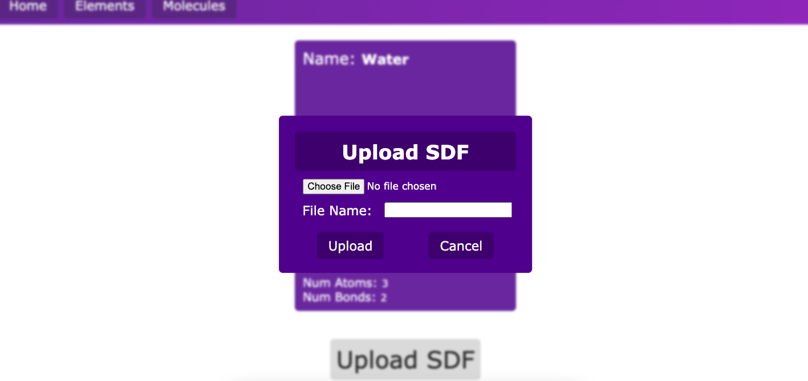
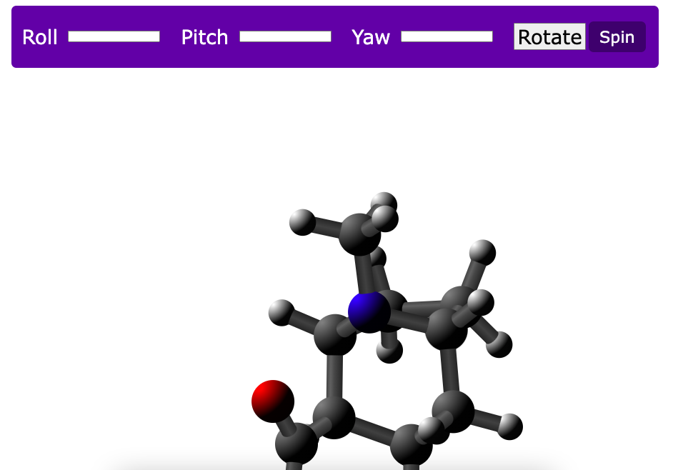

# 3D Molecule Viewer

## Project Description
This 3D molecule viewer allows you to upload and view a molecule in 3D. A generic SDF file just needs to be uploaded and can be found for free via a quick google search. Molecules are able to be rotated and the size and colour of the atoms making up molecules can be modified. 

## Screenshots

## Running the Program
- Ensure the link and include paths in the makefile point to your installed version of Python
- Run 'export LD_LIBRARY_PATH=\`pwd\`' in the terminal
- Type 'make' in the terminal
- Ensure a port has been forwarded (i.e through VSCode)
- Run the command 'python3 server.py PORT_NUMBER' to run the server with a set port number
- Connect to localhost:PORT_NUMBER/index.html to view the webpage

## Resources Used
- Modified JSON file from downloaded from https://github.com/Bowserinator/Periodic-Table-JSON